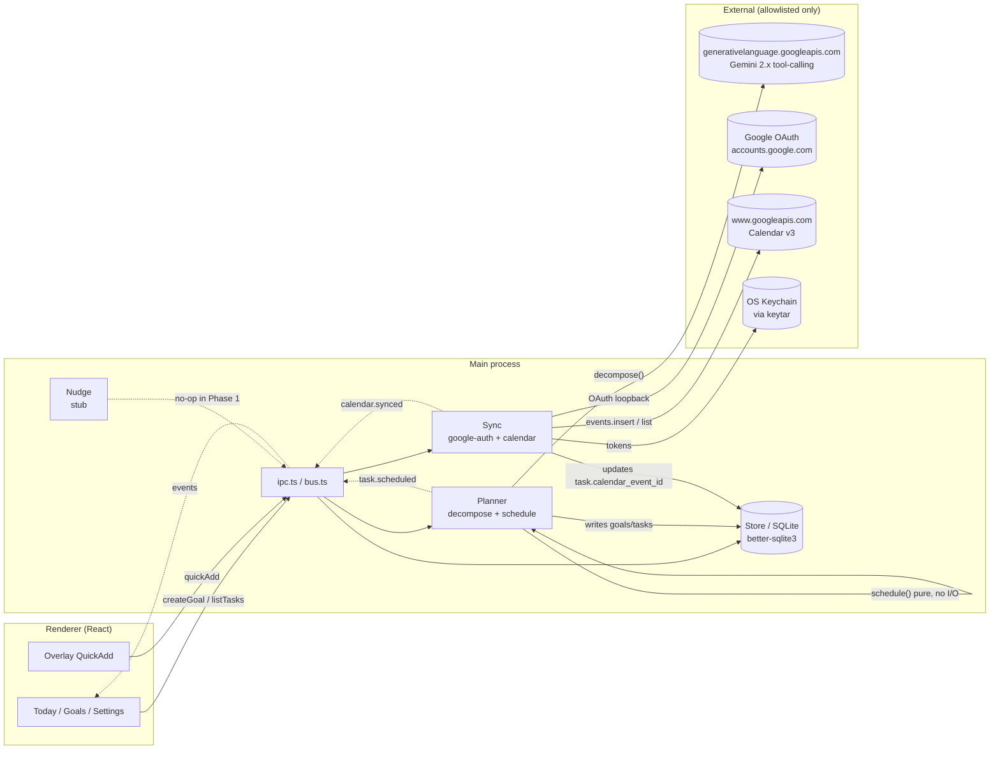
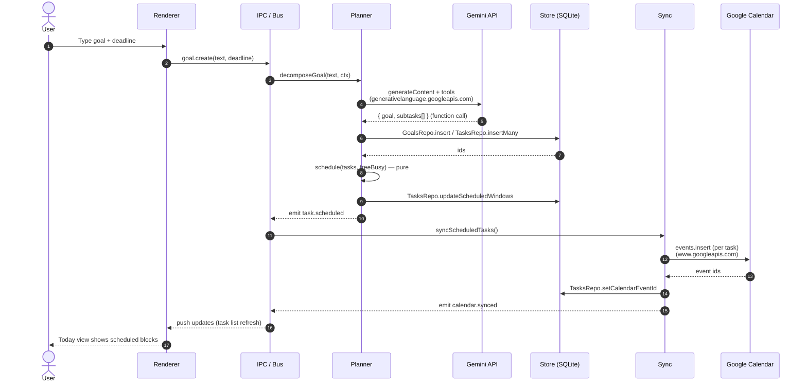

# Tendril — Phase 1 Core Architecture

Cross-cutting architecture, constraints, and conventions for **Phase 1** of Tendril. Every feature spec under [features/](./features/) assumes this doc. Read this first; the feature docs only restate what's specific to themselves.

The product motivation lives in the [product spec](../2026-05-24-task-tracker-agent-product-spec.md).

## Phase 1 scope

Phase 1 covers exactly:

- typed goal capture — [features/typed-goal-capture.md](./features/typed-goal-capture.md)
- Gemini-powered subtask decomposition — [features/subtask-decomposition.md](./features/subtask-decomposition.md)
- Deterministic Calendar auto-scheduling — [features/scheduling.md](./features/scheduling.md)
- Google Calendar sync (OAuth + writes) — [features/calendar-sync.md](./features/calendar-sync.md)
- Local todo views (Today / Goals / Settings) — [features/todo-views.md](./features/todo-views.md)
- Overlay quick-add (global hotkey) — [features/overlay-quick-add.md](./features/overlay-quick-add.md)

**Deferred to later phases — do not add yet:**

- Activity monitoring (screenshots, window titles, keystroke counts)
- Voice input (`whisper.cpp`)
- Inference / progress signals
- Nudge engine
- Windows port
- Multi-account, plugins, multi-device sync

## Runtime flow

The two diagrams below are the same Phase 1 system at different zoom levels. The flowchart names every module and the external endpoints that any outbound HTTP must come from (see "Hard constraints" below). The sequence diagram walks the canonical path: user types a goal → Gemini decomposes it → local scheduler places it → Calendar gets written.

### Module map + external endpoints



### Goal → calendar sequence



Notes:

- Every external arrow is one of the three allowlisted hosts in "Hard constraints". Nothing else should make outbound calls.
- `Planner.schedule` is intentionally pure — no DB, no network — which is why it has a self-loop instead of an external arrow. It's the most-tested module for that reason (see [features/scheduling.md](./features/scheduling.md)).
- `Nudge` is wired into the bus but does nothing in Phase 1; it exists so later phases don't reshape the module graph.

## Hard constraints

1. **Local-only data.** SQLite + local filesystem. No backend server. The only outbound HTTP traffic allowed is to `generativelanguage.googleapis.com` (Gemini), `www.googleapis.com` (Calendar), and the Google OAuth endpoints. Add a runtime allowlist check around the HTTP client.
2. **Privacy posture.** Never capture keystroke content. Never upload screenshots anywhere except (later) Gemini Vision with explicit user consent surfaced in settings.
3. **Permissions.** Phase 1 does not need Screen Recording or Accessibility — defer those to the Monitor milestone. Do not request them now.
4. **Module boundaries are load-bearing.** Modules communicate via an in-process event bus and the typed `Store` repositories. No module imports another's internals.

## Tech stack

- **Electron** (latest stable) + **TypeScript** (strict). Main process in TS, renderer in React + TS.
- **better-sqlite3** for the local DB.
- **Google API**: `googleapis` Node SDK for Calendar; OAuth 2.0 desktop flow with a loopback redirect. Tokens stored via OS keychain (`keytar`).
- **Gemini**: `@google/generative-ai` SDK. Use Gemini 2.x with **function/tool calling** for the Planner.
- **Build/dev**: `electron-vite` or `electron-forge`. `pnpm` for package management.
- **Lint/format**: `eslint` + `prettier`. CI on a `pnpm typecheck && pnpm lint && pnpm test` script.
- **Tests**: `vitest` for unit. Do not write integration tests against real Google APIs — record fixtures with `nock` instead.

## File layout

```
app/
  package.json
  electron.vite.config.ts
  src/
    main/
      index.ts                 # app lifecycle, window creation, hotkey
      ipc.ts                   # typed IPC channels
      bus.ts                   # in-process event bus
      store/
        db.ts                  # better-sqlite3 init, migrations
        repos/
          goals.ts             # GoalsRepo
          tasks.ts             # TasksRepo
          sessions.ts          # SessionsRepo (stub for Phase 1)
          activity.ts          # ActivityRepo (stub for Phase 1)
      planner/
        gemini.ts              # Gemini client wrapper, tool defs
        decompose.ts           # goal -> subtasks (uses gemini.ts)
        schedule.ts            # slot-finder
      sync/
        google-auth.ts         # OAuth flow + keychain
        calendar.ts            # Calendar reads/writes
      nudge/
        index.ts               # stub for Phase 1 (no-op except surface API)
    renderer/
      main/
        App.tsx
        pages/
          TasksToday.tsx
          GoalsList.tsx
          Settings.tsx
        components/...
      overlay/
        Overlay.tsx
        QuickAdd.tsx
    shared/
      types.ts                 # Goal, Task, ProgressSignal, etc.
      events.ts                # event-bus event names + payloads
  tests/
    planner/...
    sync/...
    store/...
```

## Data model (SQLite)

```sql
CREATE TABLE goals (
  id TEXT PRIMARY KEY,
  title TEXT NOT NULL,
  description TEXT,
  deadline TEXT,            -- ISO8601
  status TEXT NOT NULL,     -- 'active' | 'paused' | 'done' | 'dropped'
  created_at TEXT NOT NULL,
  updated_at TEXT NOT NULL
);

CREATE TABLE tasks (
  id TEXT PRIMARY KEY,
  goal_id TEXT NOT NULL REFERENCES goals(id),
  title TEXT NOT NULL,
  estimate_minutes INTEGER NOT NULL,
  depends_on TEXT,          -- JSON array of task ids
  scheduled_start TEXT,     -- ISO8601, nullable
  scheduled_end TEXT,
  calendar_event_id TEXT,   -- Google event id once scheduled
  status TEXT NOT NULL,     -- 'todo' | 'scheduled' | 'in_progress' | 'done' | 'skipped'
  created_at TEXT NOT NULL,
  updated_at TEXT NOT NULL
);

-- Stubs for later milestones; create the tables but don't write to them yet:
CREATE TABLE sessions  (id TEXT PRIMARY KEY, task_id TEXT, started_at TEXT, ended_at TEXT);
CREATE TABLE activity  (id INTEGER PRIMARY KEY AUTOINCREMENT, ts TEXT, kind TEXT, payload TEXT);
CREATE TABLE summaries (id INTEGER PRIMARY KEY AUTOINCREMENT, task_id TEXT, ts TEXT, summary TEXT, signal REAL);
```

Migrations live in `store/db.ts` as numbered SQL statements applied in order.

## Module boundaries

- **`Store`** (`main/store/`) exposes typed repos: `GoalsRepo`, `TasksRepo`, `SessionsRepo`, `ActivityRepo`. Typed CRUD only — no business logic. No module reaches into raw SQLite.
- **`Planner`** (`main/planner/`) is pure logic: `decompose` calls Gemini; `schedule` is a deterministic local function. Side effects only via `Store` and `Sync`.
- **`Sync`** (`main/sync/`) is the **only** module that talks to Google APIs.
- **`Nudge`** (`main/nudge/`) is a Phase 1 stub — surface the API, no behavior.

Modules communicate via the in-process event bus + typed `Store` repos. No module imports another module's internals.

### Event bus events (Phase 1)

- `goal.created`, `goal.updated`
- `task.scheduled`, `task.completed`
- `calendar.synced`

## Implementation order

Do the steps in this order. Each builds on the previous; don't jump ahead.

1. Scaffold the Electron + Vite + TS project. Get an empty main window rendering.
2. Add `better-sqlite3` and write the migration runner. Write `GoalsRepo` and `TasksRepo` with unit tests. See [store-layer.md](./store-layer.md).
3. Build `planner/gemini.ts` with a single hello-world tool-call against Gemini. Then `decomposeGoal` with a focused prompt and a JSON schema. Unit-test with a mocked Gemini client. See [features/subtask-decomposition.md](./features/subtask-decomposition.md).
4. Build `planner/schedule.ts` as a pure function. Unit-test extensively — this is the part most likely to have edge cases. See [features/scheduling.md](./features/scheduling.md).
5. Build the Google OAuth flow and `calendar.ts`. Use recorded fixtures with `nock` for tests. See [features/calendar-sync.md](./features/calendar-sync.md).
6. Wire the renderer: Settings → connect; main form → decompose → schedule → write events. See [features/typed-goal-capture.md](./features/typed-goal-capture.md) and [features/todo-views.md](./features/todo-views.md).
7. Add the overlay window + global hotkey last, since it depends on everything above. See [features/overlay-quick-add.md](./features/overlay-quick-add.md).

## What NOT to do

- Don't add activity monitoring, screenshots, voice, or nudges in Phase 1. They have their own milestones.
- Don't add a cloud backend.
- Don't request Accessibility / Screen Recording permissions yet.
- Don't bundle Wispr Flow, Cluely, or any third-party overlay app. Build the overlay with Electron `BrowserWindow` primitives.
- Don't add error handling for impossible states. Validate at the boundaries (user input, Google API responses) and trust internal calls.

## Cross-cutting acceptance criteria

These apply to Phase 1 as a whole. Per-feature acceptance criteria live in the feature docs.

1. `pnpm install && pnpm dev` launches the app on macOS.
2. Close the app, reopen it — state persists.
3. `pnpm test` passes with no real network calls.
4. `pnpm typecheck && pnpm lint` is clean.

## Reporting

After finishing each numbered implementation-order step above, run typecheck + lint + tests and report green before moving on. Use TDD where it helps (Planner and Scheduler — yes; UI scaffolding — no).
